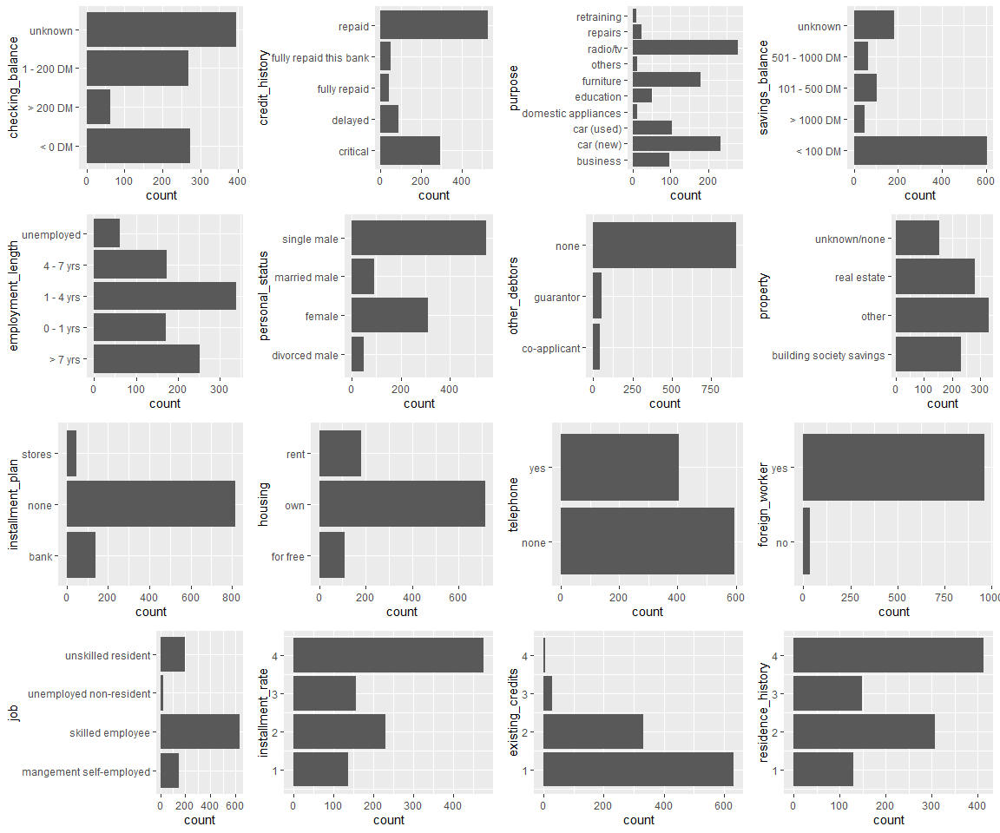
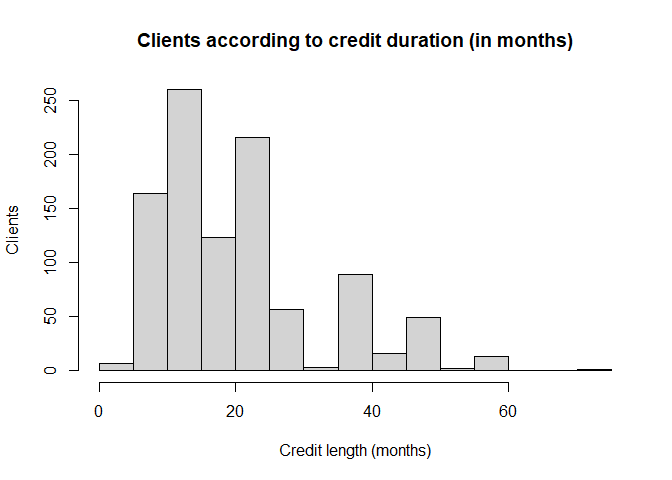
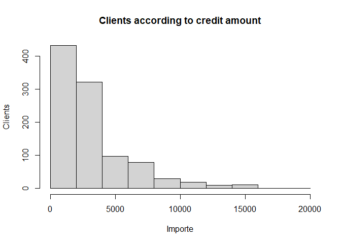
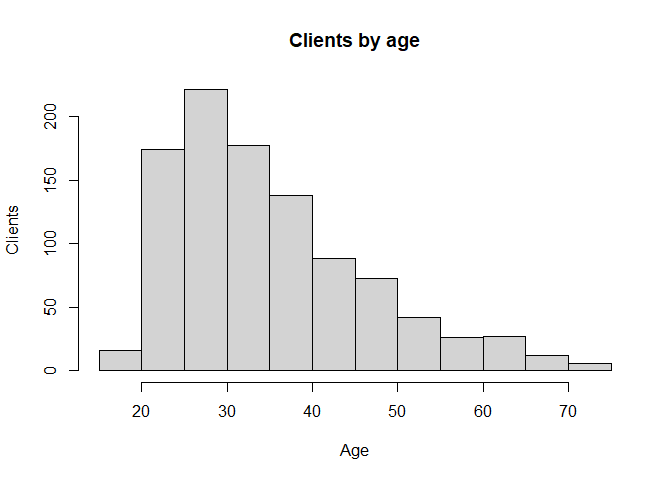
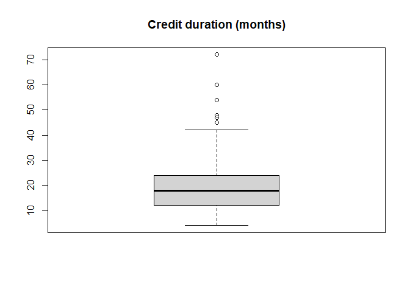
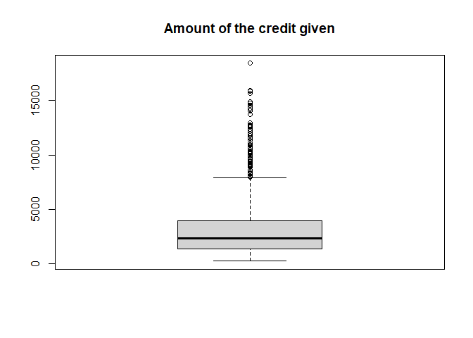
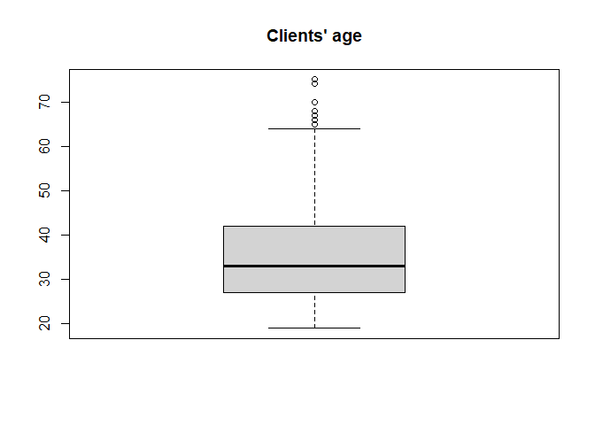
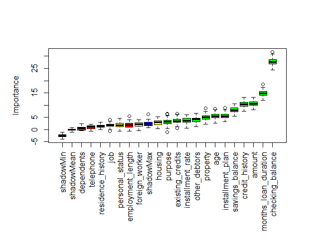
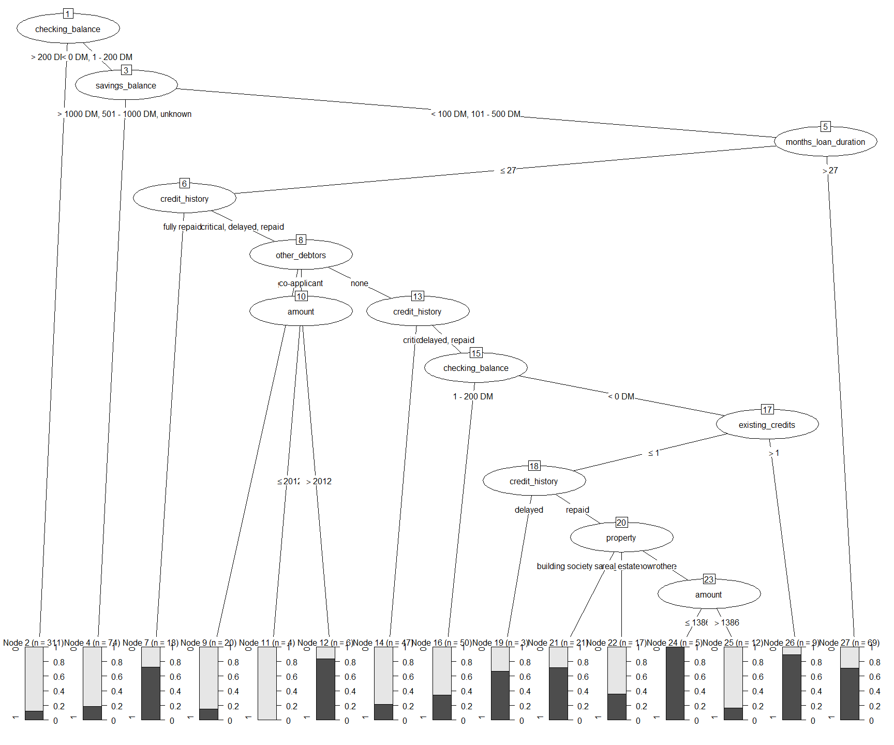

german\_credit
================

## Intro

In this work, we will focus on the generation and interpretation of a
decision tree. For that process, we will use a dataset that gives
information about credit admissions in Germany.

### 1. Initial data analysis

First, we will load the needed libraries.

``` r
library("ggplot2")
library("miscset")
library("Boruta")
library("dplyr")
library("e1071")
library("caret")
library("randomForest")
library("rpart")
```

Next, let’s see a little sample of the file.

``` r
credit <-read.csv("credit_kaggle.csv", TRUE, ",", fileEncoding = "UTF-8")
head(credit,10)
```

    ##    checking_balance months_loan_duration credit_history    purpose amount
    ## 1            < 0 DM                    6       critical   radio/tv   1169
    ## 2        1 - 200 DM                   48         repaid   radio/tv   5951
    ## 3           unknown                   12       critical  education   2096
    ## 4            < 0 DM                   42         repaid  furniture   7882
    ## 5            < 0 DM                   24        delayed  car (new)   4870
    ## 6           unknown                   36         repaid  education   9055
    ## 7           unknown                   24         repaid  furniture   2835
    ## 8        1 - 200 DM                   36         repaid car (used)   6948
    ## 9           unknown                   12         repaid   radio/tv   3059
    ## 10       1 - 200 DM                   30       critical  car (new)   5234
    ##    savings_balance employment_length installment_rate personal_status
    ## 1          unknown           > 7 yrs                4     single male
    ## 2         < 100 DM         1 - 4 yrs                2          female
    ## 3         < 100 DM         4 - 7 yrs                2     single male
    ## 4         < 100 DM         4 - 7 yrs                2     single male
    ## 5         < 100 DM         1 - 4 yrs                3     single male
    ## 6          unknown         1 - 4 yrs                2     single male
    ## 7    501 - 1000 DM           > 7 yrs                3     single male
    ## 8         < 100 DM         1 - 4 yrs                2     single male
    ## 9        > 1000 DM         4 - 7 yrs                2   divorced male
    ## 10        < 100 DM        unemployed                4    married male
    ##    other_debtors residence_history                 property age
    ## 1           none                 4              real estate  67
    ## 2           none                 2              real estate  22
    ## 3           none                 3              real estate  49
    ## 4      guarantor                 4 building society savings  45
    ## 5           none                 4             unknown/none  53
    ## 6           none                 4             unknown/none  35
    ## 7           none                 4 building society savings  53
    ## 8           none                 2                    other  35
    ## 9           none                 4              real estate  61
    ## 10          none                 2                    other  28
    ##    installment_plan  housing existing_credits default dependents telephone
    ## 1              none      own                2       1          1       yes
    ## 2              none      own                1       2          1      none
    ## 3              none      own                1       1          2      none
    ## 4              none for free                1       1          2      none
    ## 5              none for free                2       2          2      none
    ## 6              none for free                1       1          2       yes
    ## 7              none      own                1       1          1      none
    ## 8              none     rent                1       1          1       yes
    ## 9              none      own                1       1          1      none
    ## 10             none      own                2       2          1      none
    ##    foreign_worker                     job
    ## 1             yes        skilled employee
    ## 2             yes        skilled employee
    ## 3             yes      unskilled resident
    ## 4             yes        skilled employee
    ## 5             yes        skilled employee
    ## 6             yes      unskilled resident
    ## 7             yes        skilled employee
    ## 8             yes mangement self-employed
    ## 9             yes      unskilled resident
    ## 10            yes mangement self-employed

We try to look at the column composition looking for empty values and
the numeric information of each column.

``` r
summary(credit)
```

    ##  checking_balance   months_loan_duration credit_history       purpose         
    ##  Length:1000        Min.   : 4.0         Length:1000        Length:1000       
    ##  Class :character   1st Qu.:12.0         Class :character   Class :character  
    ##  Mode  :character   Median :18.0         Mode  :character   Mode  :character  
    ##                     Mean   :20.9                                              
    ##                     3rd Qu.:24.0                                              
    ##                     Max.   :72.0                                              
    ##      amount      savings_balance    employment_length  installment_rate
    ##  Min.   :  250   Length:1000        Length:1000        Min.   :1.000   
    ##  1st Qu.: 1366   Class :character   Class :character   1st Qu.:2.000   
    ##  Median : 2320   Mode  :character   Mode  :character   Median :3.000   
    ##  Mean   : 3271                                         Mean   :2.973   
    ##  3rd Qu.: 3972                                         3rd Qu.:4.000   
    ##  Max.   :18424                                         Max.   :4.000   
    ##  personal_status    other_debtors      residence_history   property        
    ##  Length:1000        Length:1000        Min.   :1.000     Length:1000       
    ##  Class :character   Class :character   1st Qu.:2.000     Class :character  
    ##  Mode  :character   Mode  :character   Median :3.000     Mode  :character  
    ##                                        Mean   :2.845                       
    ##                                        3rd Qu.:4.000                       
    ##                                        Max.   :4.000                       
    ##       age        installment_plan     housing          existing_credits
    ##  Min.   :19.00   Length:1000        Length:1000        Min.   :1.000   
    ##  1st Qu.:27.00   Class :character   Class :character   1st Qu.:1.000   
    ##  Median :33.00   Mode  :character   Mode  :character   Median :1.000   
    ##  Mean   :35.55                                         Mean   :1.407   
    ##  3rd Qu.:42.00                                         3rd Qu.:2.000   
    ##  Max.   :75.00                                         Max.   :4.000   
    ##     default      dependents     telephone         foreign_worker    
    ##  Min.   :1.0   Min.   :1.000   Length:1000        Length:1000       
    ##  1st Qu.:1.0   1st Qu.:1.000   Class :character   Class :character  
    ##  Median :1.0   Median :1.000   Mode  :character   Mode  :character  
    ##  Mean   :1.3   Mean   :1.155                                        
    ##  3rd Qu.:2.0   3rd Qu.:1.000                                        
    ##  Max.   :2.0   Max.   :2.000                                        
    ##      job           
    ##  Length:1000       
    ##  Class :character  
    ##  Mode  :character  
    ##                    
    ##                    
    ## 

``` r
str(credit)
```

    ## 'data.frame':    1000 obs. of  21 variables:
    ##  $ checking_balance    : chr  "< 0 DM" "1 - 200 DM" "unknown" "< 0 DM" ...
    ##  $ months_loan_duration: int  6 48 12 42 24 36 24 36 12 30 ...
    ##  $ credit_history      : chr  "critical" "repaid" "critical" "repaid" ...
    ##  $ purpose             : chr  "radio/tv" "radio/tv" "education" "furniture" ...
    ##  $ amount              : int  1169 5951 2096 7882 4870 9055 2835 6948 3059 5234 ...
    ##  $ savings_balance     : chr  "unknown" "< 100 DM" "< 100 DM" "< 100 DM" ...
    ##  $ employment_length   : chr  "> 7 yrs" "1 - 4 yrs" "4 - 7 yrs" "4 - 7 yrs" ...
    ##  $ installment_rate    : int  4 2 2 2 3 2 3 2 2 4 ...
    ##  $ personal_status     : chr  "single male" "female" "single male" "single male" ...
    ##  $ other_debtors       : chr  "none" "none" "none" "guarantor" ...
    ##  $ residence_history   : int  4 2 3 4 4 4 4 2 4 2 ...
    ##  $ property            : chr  "real estate" "real estate" "real estate" "building society savings" ...
    ##  $ age                 : int  67 22 49 45 53 35 53 35 61 28 ...
    ##  $ installment_plan    : chr  "none" "none" "none" "none" ...
    ##  $ housing             : chr  "own" "own" "own" "for free" ...
    ##  $ existing_credits    : int  2 1 1 1 2 1 1 1 1 2 ...
    ##  $ default             : int  1 2 1 1 2 1 1 1 1 2 ...
    ##  $ dependents          : int  1 1 2 2 2 2 1 1 1 1 ...
    ##  $ telephone           : chr  "yes" "none" "none" "none" ...
    ##  $ foreign_worker      : chr  "yes" "yes" "yes" "yes" ...
    ##  $ job                 : chr  "skilled employee" "skilled employee" "unskilled resident" "skilled employee" ...

From the preceding output, we can’t see any NA value. We also can see a
mix of numeric values with text values.

The dataset gives us a series of personal data of the clients, such as
their age, job, worked years, civil status… Along with the data, there
is a classifier on whether the client has gotten their credit approved
or not. Thus, we can expect to create a model that, starting with some
personal information can answer if a client’s profile is eligible for a
credit or not.

Some variables will need to be binarized, as they give us info which is
just true or false, and we will use “1”s or “0”s to do the job.

``` r
credit$default<-gsub(1,0,credit$default)
credit$default<-gsub(2,1,credit$default)
credit$dependents<-gsub(1,0,credit$dependents)
credit$dependents<-gsub(2,1,credit$dependents)
```

## 2. Descriptive analysis

It’s interesting to do a visual analysis to see how is the data for each
variable.

``` r
ggplotGrid(ncol = 4,
  lapply(c("checking_balance", "credit_history", "purpose", "savings_balance", "employment_length", "personal_status", "other_debtors", "property", "installment_plan", "housing", "telephone", "foreign_worker", "job", "installment_rate","existing_credits", "residence_history"),
    function(col) {
        ggplot(credit, aes_string(col)) + geom_bar() + coord_flip()
    }))
```

<!-- -->

The “installment.rate” variable gives information about the payments
made by the clients. A “4” value would be a client who misses many
payments and has little reliability, whereas a “1” value would mean a
client who pays the monthly fees without any issues.

The “dependents” variable gives information on whether the individual
has any close family members he/she has to take care of. “1” means
he/she has dependents, “0” means no dependents.

The “default” classifier gives information about the credit history, “1”
being a good credit score and “0” meaning a bad one.

We think there are some variables, specifically “foreign\_worker”,
“other\_debtors” or “installment\_plan”, that aren’t very interesting
for the analysis, as most of the data accumulate in one category.

Next, we will look at the cuantitative variables, such as
“months\_loan\_duration”, “amount” and “age”.

``` r
hist(credit$months_loan_duration,xlab="Credit length (months)", ylab="Clients", main="Clients according to credit duration (in months)")
```

<!-- -->

``` r
hist(credit$amount,xlab="Importe", ylab="Clients", main="Clients according to credit amount")
```

<!-- -->

``` r
hist(credit$age,xlab="Age", ylab="Clients", main="Clients by age")
```

<!-- -->

Reading the data, we can see how the credit lengths are centered around
20-40 months, that the majority of credits are considered low-quantity
and that the client age is centered around 25 and 30 years.

We can make boxplots of each variable in order to study their extreme
values.

``` r
boxplot(credit$months_loan_duration, main="Credit duration (months)")
```

<!-- -->

``` r
boxplot(credit$amount, main="Amount of the credit given")
```

<!-- -->

``` r
boxplot(credit$age, main="Clients' age")
```

<!-- -->

We can spot some outliers in the three boxplots, in the higher part of
the distribution. However, we will consider them acceptable values, and
won’t remove them from the sample.

It could be interesting to analyze the correlations between variables
presented before. To do so, the “Boruta” method, a Random Forest
algorithm that is able to analyze the importance of eacch variable seems
interesting. To complete this method, we think the logistical regression
is interesting to studdy all elements included in the dataset.

``` r
cols <- c("checking_balance", "credit_history", "purpose", "savings_balance", "employment_length","personal_status","other_debtors","property","installment_plan","housing","default","telephone","foreign_worker","job")

credit[,cols] <- lapply(credit[,cols],as.factor)


credit$checking_balance <- factor(credit$checking_balance)
glm.credit<- glm(default~., family=binomial, data=credit)
summary(glm.credit)
```

    ## 
    ## Call:
    ## glm(formula = default ~ ., family = binomial, data = credit)
    ## 
    ## Deviance Residuals: 
    ##     Min       1Q   Median       3Q      Max  
    ## -2.3410  -0.6994  -0.3752   0.7095   2.6116  
    ## 
    ## Coefficients:
    ##                                        Estimate Std. Error z value Pr(>|z|)    
    ## (Intercept)                          -2.666e+00  1.280e+00  -2.083 0.037226 *  
    ## checking_balance> 200 DM             -9.657e-01  3.692e-01  -2.616 0.008905 ** 
    ## checking_balance1 - 200 DM           -3.749e-01  2.179e-01  -1.720 0.085400 .  
    ## checking_balanceunknown              -1.712e+00  2.322e-01  -7.373 1.66e-13 ***
    ## months_loan_duration                  2.786e-02  9.296e-03   2.997 0.002724 ** 
    ## credit_historydelayed                 5.826e-01  3.345e-01   1.742 0.081540 .  
    ## credit_historyfully repaid            1.436e+00  4.399e-01   3.264 0.001099 ** 
    ## credit_historyfully repaid this bank  1.579e+00  4.381e-01   3.605 0.000312 ***
    ## credit_historyrepaid                  8.497e-01  2.587e-01   3.284 0.001022 ** 
    ## purposecar (new)                      7.401e-01  3.339e-01   2.216 0.026668 *  
    ## purposecar (used)                    -9.264e-01  4.409e-01  -2.101 0.035645 *  
    ## purposedomestic appliances            2.173e-01  8.041e-01   0.270 0.786976    
    ## purposeeducation                      7.764e-01  4.660e-01   1.666 0.095718 .  
    ## purposefurniture                     -5.152e-02  3.543e-01  -0.145 0.884391    
    ## purposeothers                        -7.487e-01  7.998e-01  -0.936 0.349202    
    ## purposeradio/tv                      -1.515e-01  3.370e-01  -0.450 0.653002    
    ## purposerepairs                        5.237e-01  5.933e-01   0.883 0.377428    
    ## purposeretraining                    -1.319e+00  1.233e+00  -1.070 0.284625    
    ## amount                                1.283e-04  4.444e-05   2.887 0.003894 ** 
    ## savings_balance> 1000 DM             -1.339e+00  5.249e-01  -2.551 0.010729 *  
    ## savings_balance101 - 500 DM          -3.577e-01  2.861e-01  -1.250 0.211130    
    ## savings_balance501 - 1000 DM         -3.761e-01  4.011e-01  -0.938 0.348476    
    ## savings_balanceunknown               -9.467e-01  2.625e-01  -3.607 0.000310 ***
    ## employment_length0 - 1 yrs            2.097e-01  2.947e-01   0.712 0.476718    
    ## employment_length1 - 4 yrs            9.379e-02  2.510e-01   0.374 0.708653    
    ## employment_length4 - 7 yrs           -5.544e-01  3.007e-01  -1.844 0.065230 .  
    ## employment_lengthunemployed           2.766e-01  4.134e-01   0.669 0.503410    
    ## installment_rate                      3.301e-01  8.828e-02   3.739 0.000185 ***
    ## personal_statusfemale                -2.755e-01  3.865e-01  -0.713 0.476040    
    ## personal_statusmarried male          -3.671e-01  4.537e-01  -0.809 0.418448    
    ## personal_statussingle male           -8.161e-01  3.799e-01  -2.148 0.031718 *  
    ## other_debtorsguarantor               -1.415e+00  5.685e-01  -2.488 0.012834 *  
    ## other_debtorsnone                    -4.360e-01  4.101e-01  -1.063 0.287700    
    ## residence_history                     4.776e-03  8.641e-02   0.055 0.955920    
    ## propertyother                        -8.690e-02  2.313e-01  -0.376 0.707115    
    ## propertyreal estate                  -2.814e-01  2.534e-01  -1.111 0.266630    
    ## propertyunknown/none                  4.490e-01  4.130e-01   1.087 0.277005    
    ## age                                  -1.454e-02  9.222e-03  -1.576 0.114982    
    ## installment_plannone                 -6.463e-01  2.391e-01  -2.703 0.006871 ** 
    ## installment_planstores               -1.232e-01  4.119e-01  -0.299 0.764878    
    ## housingown                            2.402e-01  4.503e-01   0.534 0.593687    
    ## housingrent                           6.839e-01  4.770e-01   1.434 0.151657    
    ## existing_credits                      2.721e-01  1.895e-01   1.436 0.151109    
    ## dependents1                           2.647e-01  2.492e-01   1.062 0.288249    
    ## telephoneyes                         -3.000e-01  2.013e-01  -1.491 0.136060    
    ## foreign_workeryes                     1.392e+00  6.258e-01   2.225 0.026095 *  
    ## jobskilled employee                   7.524e-02  2.845e-01   0.264 0.791419    
    ## jobunemployed non-resident           -4.795e-01  6.623e-01  -0.724 0.469086    
    ## jobunskilled resident                 5.666e-02  3.501e-01   0.162 0.871450    
    ## ---
    ## Signif. codes:  0 '***' 0.001 '**' 0.01 '*' 0.05 '.' 0.1 ' ' 1
    ## 
    ## (Dispersion parameter for binomial family taken to be 1)
    ## 
    ##     Null deviance: 1221.73  on 999  degrees of freedom
    ## Residual deviance:  895.82  on 951  degrees of freedom
    ## AIC: 993.82
    ## 
    ## Number of Fisher Scoring iterations: 5

``` r
exp(coefficients(glm.credit))
```

    ##                          (Intercept)             checking_balance> 200 DM 
    ##                           0.06950032                           0.38072543 
    ##           checking_balance1 - 200 DM              checking_balanceunknown 
    ##                           0.68739005                           0.18052465 
    ##                 months_loan_duration                credit_historydelayed 
    ##                           1.02825514                           1.79070638 
    ##           credit_historyfully repaid credit_historyfully repaid this bank 
    ##                           4.20288662                           4.85082737 
    ##                 credit_historyrepaid                     purposecar (new) 
    ##                           2.33884687                           2.09611755 
    ##                    purposecar (used)           purposedomestic appliances 
    ##                           0.39598454                           1.24272197 
    ##                     purposeeducation                     purposefurniture 
    ##                           2.17356936                           0.94978130 
    ##                        purposeothers                      purposeradio/tv 
    ##                           0.47298146                           0.85942082 
    ##                       purposerepairs                    purposeretraining 
    ##                           1.68824739                           0.26731009 
    ##                               amount             savings_balance> 1000 DM 
    ##                           1.00012828                           0.26205553 
    ##          savings_balance101 - 500 DM         savings_balance501 - 1000 DM 
    ##                           0.69925445                           0.68655230 
    ##               savings_balanceunknown           employment_length0 - 1 yrs 
    ##                           0.38802357                           1.23332539 
    ##           employment_length1 - 4 yrs           employment_length4 - 7 yrs 
    ##                           1.09833296                           0.57442985 
    ##          employment_lengthunemployed                     installment_rate 
    ##                           1.31867114                           1.39109306 
    ##                personal_statusfemale          personal_statusmarried male 
    ##                           0.75922674                           0.69275985 
    ##           personal_statussingle male               other_debtorsguarantor 
    ##                           0.44216244                           0.24300734 
    ##                    other_debtorsnone                    residence_history 
    ##                           0.64658694                           1.00478747 
    ##                        propertyother                  propertyreal estate 
    ##                           0.91676550                           0.75469752 
    ##                 propertyunknown/none                                  age 
    ##                           1.56675954                           0.98556964 
    ##                 installment_plannone               installment_planstores 
    ##                           0.52396591                           0.88408633 
    ##                           housingown                          housingrent 
    ##                           1.27155326                           1.98151198 
    ##                     existing_credits                          dependents1 
    ##                           1.31268667                           1.30300272 
    ##                         telephoneyes                    foreign_workeryes 
    ##                           0.74081231                           4.02375659 
    ##                  jobskilled employee           jobunemployed non-resident 
    ##                           1.07814530                           0.61910819 
    ##                jobunskilled resident 
    ##                           1.05829078

From the analysis made before, we can classify variables in
statistically significative or not. Criteria will be OR (Odds Ratio) and
p-values. If a variable presents values higher than 1 in its OR
attributes, it can be considered not significative. Talking about the
p-value, we will work with a 95% confidence degree, which means that if
it’s higher than 0.05 the variable won’t be considered significative.

``` r
fit <- Boruta(Species ~ ., data = iris, doTrace = 2);
boruta.credit_train <- Boruta(default~., data = credit, doTrace = 2)
```

``` r
print(boruta.credit_train)
```

    ## Boruta performed 99 iterations in 49.20985 secs.
    ##  12 attributes confirmed important: age, amount, checking_balance,
    ## credit_history, existing_credits and 7 more;
    ##  5 attributes confirmed unimportant: dependents, employment_length,
    ## job, residence_history, telephone;
    ##  3 tentative attributes left: foreign_worker, housing, personal_status;

``` r
par(mar=c(10,5,5,5)+.1)
plot(boruta.credit_train, xlab= "", las=3)
```

<!-- -->

The “Boruta” method gives us a sense of which are the most important
variables in this analysis. We consider the 12 variables “Boruta”
considers important are interesting for our work.

The random forest “Boruta” runs has its reservations about 5 variables:
however, its high p-values can make the case for their removal. We will
therefore just work with our 12 variables.

## 3. First decision tree

First, we will clean the dataframe in order to get only the variables of
interest.

``` r
credit<-subset(credit, select=(c(1:6,8,10,12:14,16,17)))  
```

Then we will build a test and train model, using 2/3 of the data for the
training set and 1/3 for the test set.

``` r
set.seed(1432)
y <- credit[,13] 
x <- credit[,1:12] 
```

We can now separate the data according to a parameter, with split\_prop.
We will also create a function that separes data in two groups.

## 4. First decision tree and error

We can now analyze the generated decision tree, and the obtained rules.

``` r
split_prop <- 3
max_split<-floor(nrow(x)/split_prop)
tr_limit <- nrow(x)-max_split
ts_limit <- nrow(x)-max_split+1

trainx <- x[1:tr_limit,]
trainy <- y[1:tr_limit]
testx <- x[ts_limit+1:nrow(x),]
testy <- y[ts_limit+1:nrow(x)]

split_prop <- 3
indexes = sample(1:nrow(credit), size=floor(((split_prop-1)/split_prop)*nrow(credit)))
trainx<-x[indexes,]
trainy<-y[indexes]
testx<-x[-indexes,]
testy<-y[-indexes]

summary(testx)
```

    ##    checking_balance months_loan_duration                credit_history
    ##  < 0 DM    : 98     Min.   : 4.00        critical              :100   
    ##  > 200 DM  : 26     1st Qu.:12.00        delayed               : 27   
    ##  1 - 200 DM: 90     Median :18.00        fully repaid          : 17   
    ##  unknown   :120     Mean   :21.52        fully repaid this bank: 17   
    ##                     3rd Qu.:24.00        repaid                :173   
    ##                     Max.   :60.00                                     
    ##                                                                       
    ##        purpose       amount           savings_balance installment_rate
    ##  radio/tv  :96   Min.   :  276   < 100 DM     :205    Min.   :1.000   
    ##  car (new) :72   1st Qu.: 1396   > 1000 DM    : 16    1st Qu.:2.000   
    ##  furniture :64   Median : 2468   101 - 500 DM : 37    Median :3.000   
    ##  car (used):39   Mean   : 3426   501 - 1000 DM: 24    Mean   :2.988   
    ##  business  :31   3rd Qu.: 4097   unknown      : 52    3rd Qu.:4.000   
    ##  education :19   Max.   :18424                        Max.   :4.000   
    ##  (Other)   :13                                                        
    ##       other_debtors                     property        age       
    ##  co-applicant: 11   building society savings: 82   Min.   :19.00  
    ##  guarantor   : 23   other                   :109   1st Qu.:26.25  
    ##  none        :300   real estate             : 90   Median :33.00  
    ##                     unknown/none            : 53   Mean   :35.00  
    ##                                                    3rd Qu.:41.00  
    ##                                                    Max.   :68.00  
    ##                                                                   
    ##  installment_plan existing_credits
    ##  bank  : 50       Min.   :1.000   
    ##  none  :265       1st Qu.:1.000   
    ##  stores: 19       Median :1.000   
    ##                   Mean   :1.383   
    ##                   3rd Qu.:2.000   
    ##                   Max.   :4.000   
    ## 

``` r
summary(testy)
```

    ##   0   1 
    ## 221 113

``` r
summary(trainx)
```

    ##    checking_balance months_loan_duration                credit_history
    ##  < 0 DM    :176     Min.   : 4.00        critical              :193   
    ##  > 200 DM  : 37     1st Qu.:12.00        delayed               : 61   
    ##  1 - 200 DM:179     Median :18.00        fully repaid          : 23   
    ##  unknown   :274     Mean   :20.59        fully repaid this bank: 32   
    ##                     3rd Qu.:24.00        repaid                :357   
    ##                     Max.   :72.00                                     
    ##                                                                       
    ##        purpose        amount           savings_balance installment_rate
    ##  radio/tv  :184   Min.   :  250   < 100 DM     :398    Min.   :1.000   
    ##  car (new) :162   1st Qu.: 1346   > 1000 DM    : 32    1st Qu.:2.000   
    ##  furniture :117   Median : 2222   101 - 500 DM : 66    Median :3.000   
    ##  business  : 66   Mean   : 3194   501 - 1000 DM: 39    Mean   :2.965   
    ##  car (used): 64   3rd Qu.: 3964   unknown      :131    3rd Qu.:4.000   
    ##  education : 31   Max.   :15857                        Max.   :4.000   
    ##  (Other)   : 42                                                        
    ##       other_debtors                     property        age       
    ##  co-applicant: 30   building society savings:150   Min.   :19.00  
    ##  guarantor   : 29   other                   :223   1st Qu.:27.00  
    ##  none        :607   real estate             :192   Median :33.00  
    ##                     unknown/none            :101   Mean   :35.82  
    ##                                                    3rd Qu.:42.00  
    ##                                                    Max.   :75.00  
    ##                                                                   
    ##  installment_plan existing_credits
    ##  bank  : 89       Min.   :1.000   
    ##  none  :549       1st Qu.:1.000   
    ##  stores: 28       Median :1.000   
    ##                   Mean   :1.419   
    ##                   3rd Qu.:2.000   
    ##                   Max.   :4.000   
    ## 

``` r
summary(trainy)
```

    ##   0   1 
    ## 479 187

``` r
trainy = as.factor(trainy)
model <- C50::C5.0(trainx, trainy,rules=TRUE )
summary(model)
```

    ## 
    ## Call:
    ## C5.0.default(x = trainx, y = trainy, rules = TRUE)
    ## 
    ## 
    ## C5.0 [Release 2.07 GPL Edition]      Sun Oct 31 14:14:43 2021
    ## -------------------------------
    ## 
    ## Class specified by attribute `outcome'
    ## 
    ## Read 666 cases (13 attributes) from undefined.data
    ## 
    ## Rules:
    ## 
    ## Rule 1: (311/38, lift 1.2)
    ##  checking_balance in {> 200 DM, unknown}
    ##  ->  class 0  [0.875]
    ## 
    ## Rule 2: (202/28, lift 1.2)
    ##  savings_balance in {> 1000 DM, 501 - 1000 DM, unknown}
    ##  ->  class 0  [0.858]
    ## 
    ## Rule 3: (491/98, lift 1.1)
    ##  months_loan_duration <= 27
    ##  credit_history in {critical, delayed, repaid}
    ##  ->  class 0  [0.799]
    ## 
    ## Rule 4: (13, lift 3.3)
    ##  checking_balance in {< 0 DM, 1 - 200 DM}
    ##  credit_history in {critical, repaid}
    ##  amount <= 1386
    ##  property = other
    ##  existing_credits <= 1
    ##  ->  class 1  [0.933]
    ## 
    ## Rule 5: (12/1, lift 3.1)
    ##  checking_balance = < 0 DM
    ##  credit_history in {delayed, repaid}
    ##  savings_balance = < 100 DM
    ##  existing_credits > 1
    ##  ->  class 1  [0.857]
    ## 
    ## Rule 6: (9/1, lift 2.9)
    ##  checking_balance = < 0 DM
    ##  credit_history = delayed
    ##  savings_balance = < 100 DM
    ##  ->  class 1  [0.818]
    ## 
    ## Rule 7: (36/9, lift 2.6)
    ##  checking_balance in {< 0 DM, 1 - 200 DM}
    ##  credit_history in {fully repaid, fully repaid this bank}
    ##  savings_balance in {< 100 DM, 101 - 500 DM}
    ##  ->  class 1  [0.737]
    ## 
    ## Rule 8: (36/10, lift 2.5)
    ##  checking_balance = < 0 DM
    ##  credit_history in {delayed, repaid}
    ##  savings_balance in {< 100 DM, 101 - 500 DM}
    ##  other_debtors = none
    ##  property in {building society savings, unknown/none}
    ##  ->  class 1  [0.711]
    ## 
    ## Rule 9: (69/20, lift 2.5)
    ##  checking_balance in {< 0 DM, 1 - 200 DM}
    ##  months_loan_duration > 27
    ##  savings_balance in {< 100 DM, 101 - 500 DM}
    ##  ->  class 1  [0.704]
    ## 
    ## Rule 10: (82/33, lift 2.1)
    ##  checking_balance = < 0 DM
    ##  credit_history in {delayed, repaid}
    ##  savings_balance in {< 100 DM, 101 - 500 DM}
    ##  other_debtors = none
    ##  ->  class 1  [0.595]
    ## 
    ## Default class: 0
    ## 
    ## 
    ## Evaluation on training data (666 cases):
    ## 
    ##          Rules     
    ##    ----------------
    ##      No      Errors
    ## 
    ##      10  120(18.0%)   <<
    ## 
    ## 
    ##     (a)   (b)    <-classified as
    ##    ----  ----
    ##     445    34    (a): class 0
    ##      86   101    (b): class 1
    ## 
    ## 
    ##  Attribute usage:
    ## 
    ##   84.08% months_loan_duration
    ##   82.28% credit_history
    ##   71.47% checking_balance
    ##   53.90% savings_balance
    ##   12.31% other_debtors
    ##    7.36% property
    ##    3.75% existing_credits
    ##    1.95% amount
    ## 
    ## 
    ## Time: 0.0 secs

``` r
model <- C50::C5.0(trainx, trainy)
plot(model)
```

<!-- -->

We get a 18% error rate, with an incorrect classification of 120 objets
out of 666.

## 5. Rules obtained

In the tree, we get the following rules (a total of 10):

-   Rule 1: Checking\_balance bigger than 200 DM or unknown, denied
    credit (87,5% confidence).

-   Rule 2: Checking\_balance bigger than 1000 DM or unknown, denied
    credit (85,8% confidence).

-   Rule 3: Months\_loan\_duration lower or equal to 27 months,
    credit\_history critical, delayed or repaid, denied credit (79,9%).

-   Rule 4: Checking\_balance lower than 0 DM or between 1 and 200 DM,
    credit\_history between critical and repaid, amount lower or equal
    to 1386, property equal to other, with existing credits, credit
    accepted (93,3%).

-   Rule 5: Checking\_balance lower than 0 DM, credit\_history delayed
    or repaid, savings balance equal or lower to 100 DM,
    existing\_credits higher than 1, credit accepted (85,7%).

-   Rule 6: Checking\_balance equal or lower than 0 DM, credit\_history
    delayed and savings balance equal or lower than 100 DM, credit
    accepted (81,8%).

-   Rule 7: Checking\_balance lower than 0 DM or between 1 and 200 DM,
    credit\_history fully repaid or repaid this bank, savings\_balance
    lower than 100 DM or between 101 y 500 DM, credit accepted (73,7%).

-   Rule 8: Checking\_balance equal or lower than 0 DM, credit\_history
    between delayed and repaid, savings\_balance between lower than 100
    DM o between 101 y 500 DM, other\_debtors equal to none, and
    property equal to building society savings or unknown/none, credit
    accepted (71,1%).

-   Rule 9: Checking\_balance lower than 0 DM and between 1 and 200 DM,
    months\_loan\_duration higher than 27, savings balance lower than
    100 DM or between 101-500 DM, credit accepted (70,4%).

-   Rule 10: Checking\_balance equal or lower to 0 DM, credit\_history
    delayed or repaid, savings balance lower than 100 DM or between 101
    and 500 DM, other debtors equal a none, crédito accepted (59,5%).

## 6. Quality measure

We will try to measure the model’s quality from the test data initially
saved.

``` r
predicted_model <- predict( model, testx, type="class" )
print(sprintf("The tree's precission is: %.4f %%",100*sum(predicted_model == testy) / length(predicted_model)))
```

    ## [1] "The tree's precission is: 72.4551 %"

The confusion matrix is the following.

``` r
mat_conf<-table(testy,Predicted=predicted_model)
mat_conf
```

    ##      Predicted
    ## testy   0   1
    ##     0 196  25
    ##     1  67  46

We will interpret the result of the confusion matrix as follows.

``` r
porcentaje_correct<-100 * sum(diag(mat_conf)) / sum(mat_conf)
print(sprintf("The percentage of results correctly classified is: %.4f %%",porcentaje_correct))
```

    ## [1] "The percentage of results correctly classified is: 72.4551 %"

If we install the gmodels package, we can get some more interesting
information.

``` r
if(!require(gmodels)){
    install.packages('gmodels', repos='http://cran.us.r-project.org')
    library(gmodels)
}
```

    ## Loading required package: gmodels

    ## Warning: package 'gmodels' was built under R version 4.0.5

``` r
CrossTable(testy, predicted_model,prop.chisq  = FALSE, prop.c = FALSE, prop.r =FALSE,dnn = c('Reality', 'Prediction'))
```

    ## 
    ##  
    ##    Cell Contents
    ## |-------------------------|
    ## |                       N |
    ## |         N / Table Total |
    ## |-------------------------|
    ## 
    ##  
    ## Total Observations in Table:  334 
    ## 
    ##  
    ##              | Prediction 
    ##      Reality |         0 |         1 | Row Total | 
    ## -------------|-----------|-----------|-----------|
    ##            0 |       196 |        25 |       221 | 
    ##              |     0.587 |     0.075 |           | 
    ## -------------|-----------|-----------|-----------|
    ##            1 |        67 |        46 |       113 | 
    ##              |     0.201 |     0.138 |           | 
    ## -------------|-----------|-----------|-----------|
    ## Column Total |       263 |        71 |       334 | 
    ## -------------|-----------|-----------|-----------|
    ## 
    ## 

## 7. Complementary models

We have analyzed the most significative variables according to a
classical decision tree. Now, we want to apply complementary models to
our analysis.

### 7.1 Random Forest

Random Forest is an algorithm of supervised learning, which builds a
“forest” of decision trees, from a training set.

Next, we will show how this algorithm can apply to this dataset.

``` r
modelo<-randomForest(default~., data=credit, proximity=T)
library("randomForest")

modelo<-randomForest(trainx, trainy, proximity=T)
modelo
```

    ## 
    ## Call:
    ##  randomForest(x = trainx, y = trainy, proximity = T) 
    ##                Type of random forest: classification
    ##                      Number of trees: 500
    ## No. of variables tried at each split: 3
    ## 
    ##         OOB estimate of  error rate: 23.12%
    ## Confusion matrix:
    ##     0  1 class.error
    ## 0 440 39  0.08141962
    ## 1 115 72  0.61497326

``` r
predicted_model1 <- predict( modelo, testx, type="class" )
print(sprintf("The Random Forest's accuracy is: %.4f %%",100*sum(predicted_model1 == testy) / length(predicted_model1)))
```

    ## [1] "The Random Forest's accuracy is: 73.0539 %"

``` r
mat_conf1<-table(testy,Predicted=predicted_model1)
mat_conf1
```

    ##      Predicted
    ## testy   0   1
    ##     0 196  25
    ##     1  65  48

We can note how the model has obtained an accuracy of 70,35%.

### 7.2 Bayesian Model

We will use a CART tree, which is a variation of the classical decision
tree. It works as follows.

``` r
modelo2<-naiveBayes(trainx, trainy, proximity=T)
modelo2
```

    ## 
    ## Naive Bayes Classifier for Discrete Predictors
    ## 
    ## Call:
    ## naiveBayes.default(x = trainx, y = trainy, proximity = T)
    ## 
    ## A-priori probabilities:
    ## trainy
    ##         0         1 
    ## 0.7192192 0.2807808 
    ## 
    ## Conditional probabilities:
    ##       checking_balance
    ## trainy     < 0 DM   > 200 DM 1 - 200 DM    unknown
    ##      0 0.18371608 0.06263048 0.24634656 0.50730689
    ##      1 0.47058824 0.03743316 0.32620321 0.16577540
    ## 
    ##       months_loan_duration
    ## trainy     [,1]     [,2]
    ##      0 18.74113 10.94756
    ##      1 25.33155 13.91051
    ## 
    ##       credit_history
    ## trainy   critical    delayed fully repaid fully repaid this bank     repaid
    ##      0 0.33820459 0.09185804   0.01461378             0.02922756 0.52609603
    ##      1 0.16577540 0.09090909   0.08556150             0.09625668 0.56149733
    ## 
    ##       purpose
    ## trainy    business   car (new)  car (used) domestic appliances   education
    ##      0 0.083507307 0.223382046 0.116910230         0.014613779 0.037578288
    ##      1 0.139037433 0.294117647 0.042780749         0.021390374 0.069518717
    ##       purpose
    ## trainy   furniture      others    radio/tv     repairs  retraining
    ##      0 0.181628392 0.012526096 0.296450939 0.018789144 0.014613779
    ##      1 0.160427807 0.010695187 0.224598930 0.032085561 0.005347594
    ## 
    ##       amount
    ## trainy     [,1]     [,2]
    ##      0 2884.789 2357.359
    ##      1 3984.599 3488.247
    ## 
    ##       savings_balance
    ## trainy   < 100 DM  > 1000 DM 101 - 500 DM 501 - 1000 DM    unknown
    ##      0 0.54906054 0.06054280   0.08768267    0.06889353 0.23382046
    ##      1 0.72192513 0.01604278   0.12834225    0.03208556 0.10160428
    ## 
    ##       installment_rate
    ## trainy     [,1]     [,2]
    ##      0 2.924843 1.140079
    ##      1 3.069519 1.112239
    ## 
    ##       other_debtors
    ## trainy co-applicant  guarantor       none
    ##      0   0.03757829 0.04592902 0.91649269
    ##      1   0.06417112 0.03743316 0.89839572
    ## 
    ##       property
    ## trainy building society savings     other real estate unknown/none
    ##      0                0.2254697 0.3277662   0.3215031    0.1252610
    ##      1                0.2245989 0.3529412   0.2032086    0.2192513
    ## 
    ##       age
    ## trainy     [,1]     [,2]
    ##      0 36.51983 11.85102
    ##      1 34.03209 10.99751
    ## 
    ##       installment_plan
    ## trainy       bank       none     stores
    ##      0 0.11482255 0.85594990 0.02922756
    ##      1 0.18181818 0.74331551 0.07486631
    ## 
    ##       existing_credits
    ## trainy     [,1]      [,2]
    ##      0 1.425887 0.5912879
    ##      1 1.401070 0.5816171

``` r
predicted_model2 <- predict( modelo2, testx, type="class" )
print(sprintf("The Bayesian Model's accuracy is: %.4f %%",100*sum(predicted_model2 == testy) / length(predicted_model2)))
```

    ## [1] "The Bayesian Model's accuracy is: 71.2575 %"

``` r
mat_conf2<-table(testy,Predicted=predicted_model2)
mat_conf2
```

    ##      Predicted
    ## testy   0   1
    ##     0 190  31
    ##     1  65  48

Therefore, this model’s accuracy is of 72.25%.

## 8. Conclusions

-   The 3 models give a pretty similar accuracy, of between 70 and
    72.5%. Thus, we can admit the models are fairly similar, but the
    best result is given to us by the C50 algorithm.

-   The most important variable according to the “Boruta” method is
    “checking\_balance”. There is a series of variables that aren’t
    interesting for the analysis, and that are discarded, following
    Boruta’s analysis and the logistical regression.

-   We obtain 10 rules, which are interesting to study the associations
    between the data and the obtention of a credit.

### 9. Bibliography

We get ideas for this analysis from the following links.

-   <https://www.r-bloggers.com/2018/01/understanding-naive-bayes-classifier-using-r/>

-   <https://www.youtube.com/watch?v=6EXPYzbfLCE&t=786s>
